# Paper: Biological applications of knowledge graphs embedding models

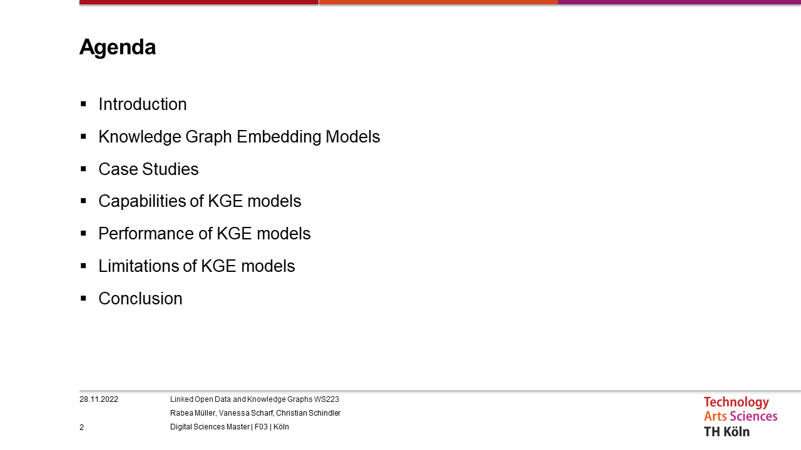

Basic networks can not preserve the semantics of different types of associations between entities (e. g. protein-protein interaction), so can‘t differenciate between different types of interactions such as inhibition, activation etc. So we need a heterogenous multi-relational network, e. g. knowledge graphs).

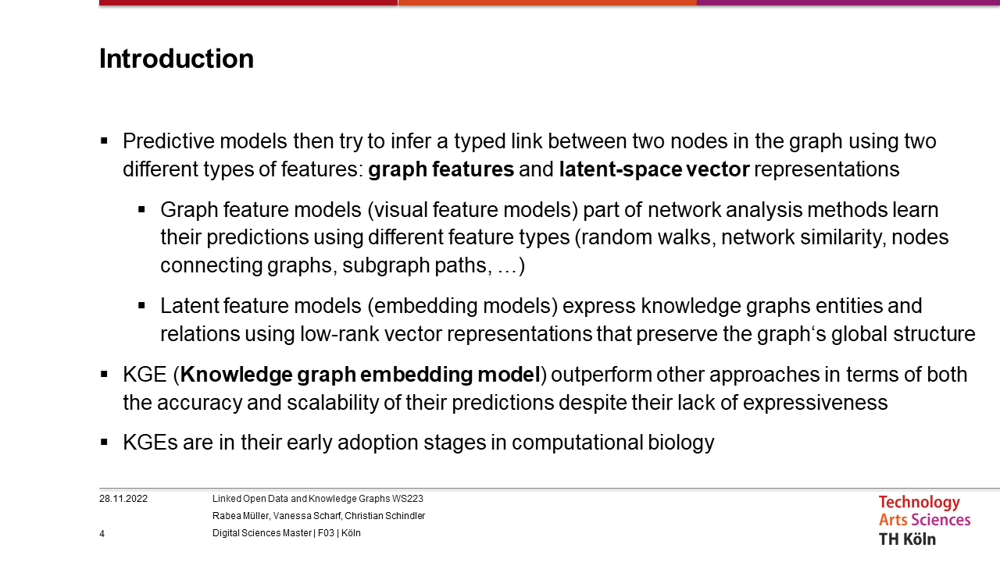

In this presentation we look a bit deeper into the knowledge graph embedding model, that are extending a knowledge graph with machine learning approaches.

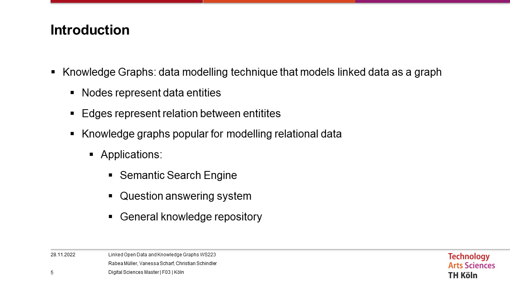

This example shows a biological knowledge graph. Mostly, the relationships in biological knowledge graphs are named after their connected nodes. Example: Node 1 - Drug, Node 2 - Target, Name of Relationship - Drug Target.

This picture has been taken out of the paper this presentation is related to.

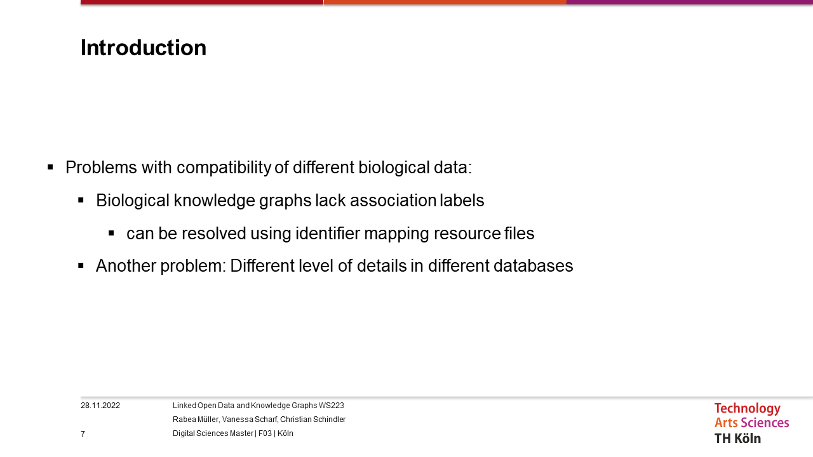

There is no global identifier or association labels. So every biological database saves their data with their own schema. This can make it difficult to operate with data from different sources. 

Example of different biological databases and their different information that is accessible.

This picture has been taken out of the paper this presentation is related to.

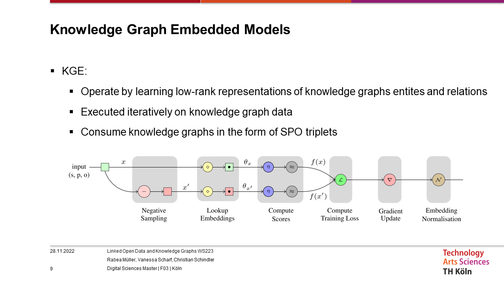

Initially all entities and relations are assigned random embeddings (noise) then updated using a multi-phase learning procedure
    1. Generate negative samples from the input true triples using uniform random corruptions of the subjects and objects
    2. Lookup corresponding embedding of both true and corrupted triplets 
    3. Model-dependent scoring functions used to generate scores for all triples
    4. Compute training loss with model-dependent loss functions (Objective: Maximize scores of true triplets and minimize score of corrupted triplets)

Traditionally KGE Models use a ranking loss, because of the linear computing time
Some use multi-class based strategies to model training loss. (Superior predictive accuracy compared to traditional ranking-based loss strategies, but limited scalability as they operate on the full entity vocabulary.

KGE models minimize their training loss using different variations of the gradient descent algorithm.
Some KGE models normalize their embeddings as a regularization strategy to enhance their generalization (often associated to models with ranking-based training loss strategies).

This picture has been taken out of the paper this presentation is related to.

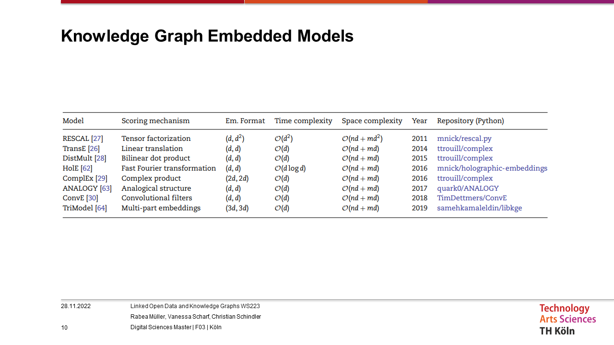

This picture has been taken out of the paper this presentation is related to.

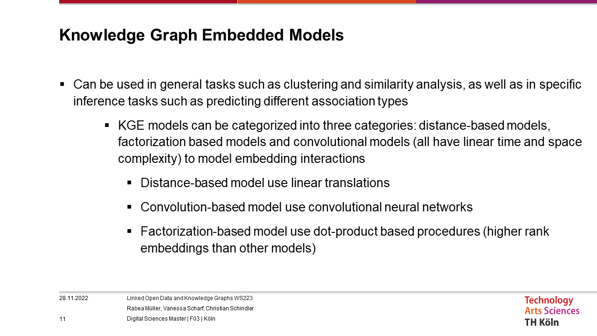

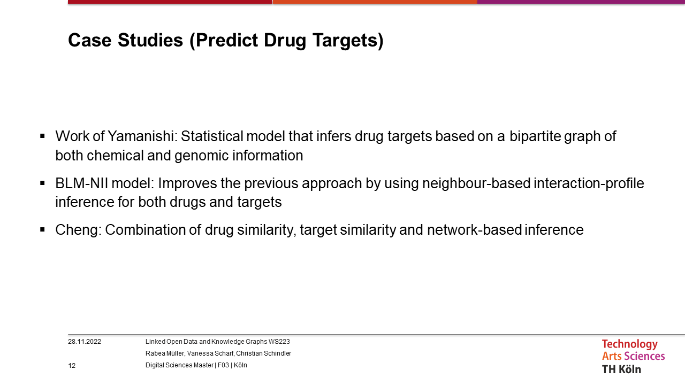

Data used for this study: DrugBank_FDA benchmarking data

In this and the next slide you can see the possible models that can be used for this case-study. The order of the models implies their development order. So the second model is an extended version or a further development of the first one etc. 

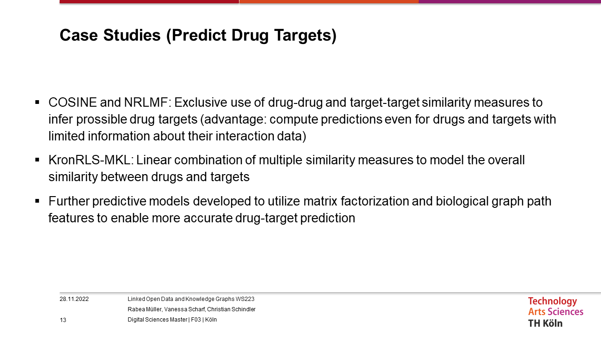

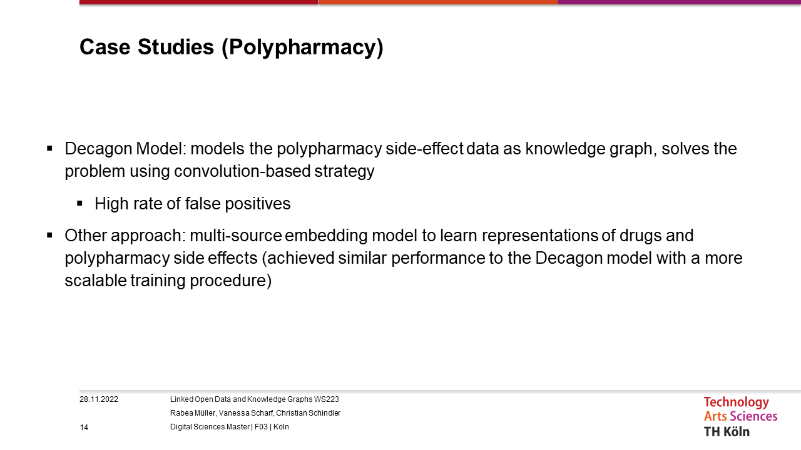

Data used for this study (compiled by Zitnik): http://snap.stanford.edu/decagon/ 

Polypharmacy means that multiple different drugs are in one medicine. This study deals with the prediction of different side-effects in polypharmacy. Here you can see models that can be used for this study.

Data used for this study (compiled by Zitnik): http://snap.stanford.edu/ohmnet/

The last study is a prediction of tissue-specific protein functions. Here you can see models that can be used for this study.

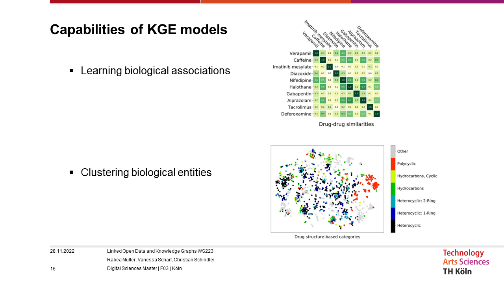

Here are two another examples, where KGE-models can be used. The first one is to find similarities inside the data. In other words: This could express which drugs are similar regarding their structure. The second example is a Clustering algorithm, that is clustering biological entities. An example could be to find out which proteins only belogs to a specific tissue. 

This pictures have been taken out of the paper this presentation is related to.

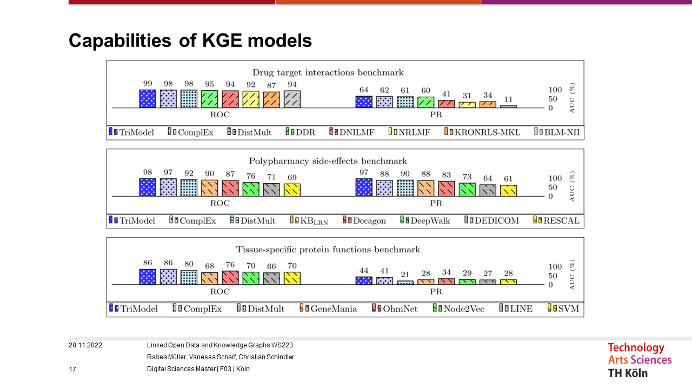

Here you can see the performence comparison of different algorithms, including KGE models like TriModel, ComplEx, DistMult.

This picture has been taken out of the paper this presentation is related to.

Here you can see the performance of different KGE-Models in four different dimensions.

A: relationship between the training runtime and the size of the processed data
B: relationship between the training runtime and the model embedding size
C: relationship between the runtime of KGE models and the number of negative samples
D: relationship between size of the batch on the training runtime

This picture has been taken out of the paper this presentation is related to.

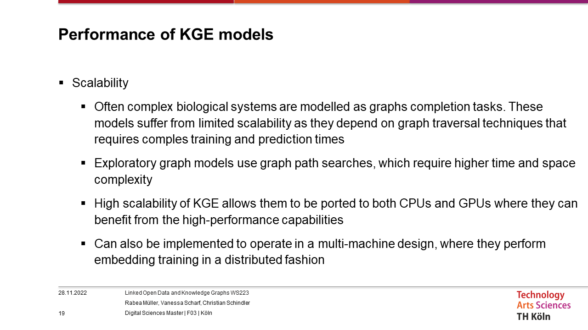

In the next three slides (including this one) you can see the problems/limitations of KGE-Models.

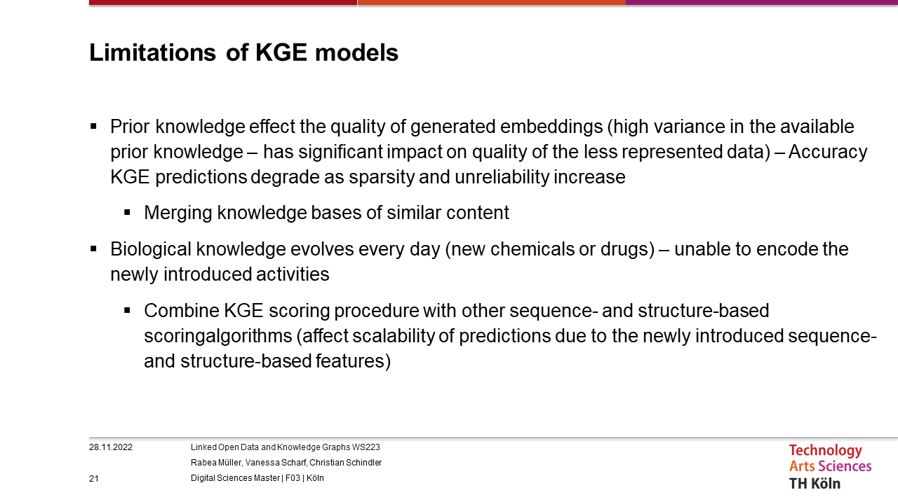

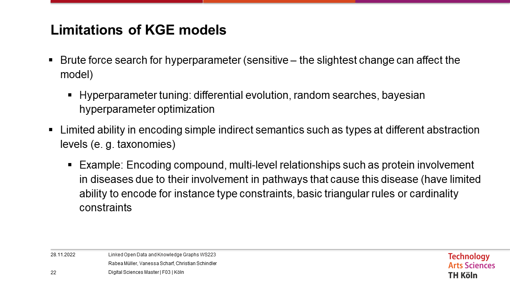

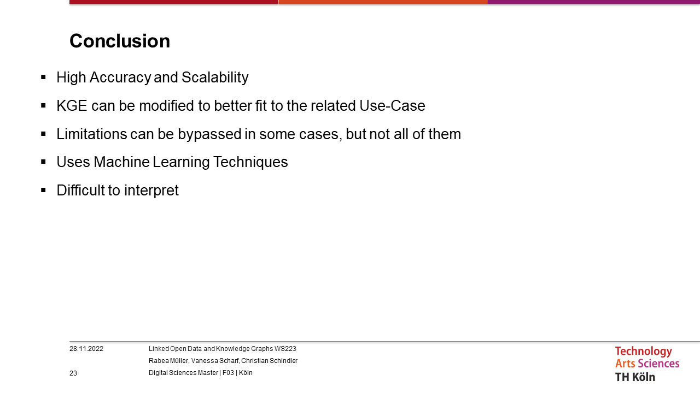